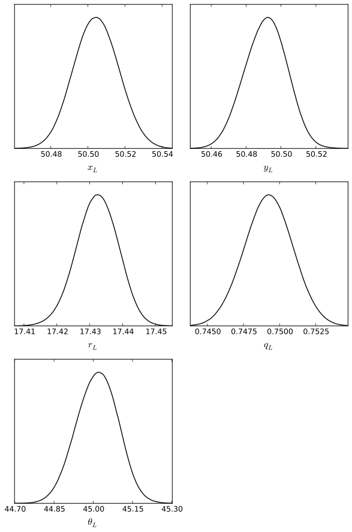
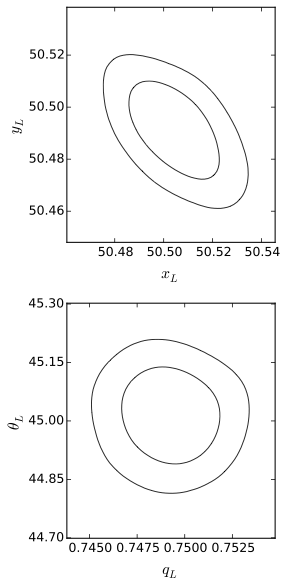
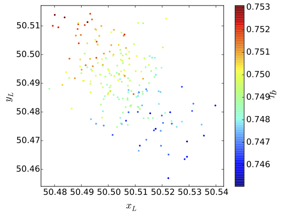
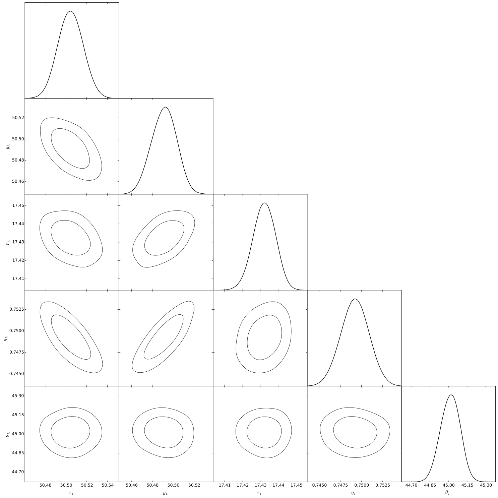

Analysing the results
=====================

At the end of the run, Lensed will output a summary of the statistics and a
table for the parameter values. The table columns give the individual marginal
mean values, standard deviations (sigma), maximum likelihood (ML) and maximum a
posteriori (MAP) parameters.

    summary
      
      log-evidence: -5123.3227 ± 0.4202
      max log-like: -5061.6840
      min chi²/dof: 1.0136
      
    parameters
      
      parameter         mean       sigma          ML         MAP
      ----------------------------------------------------------
      x_L            50.5049      0.0118     50.5107     50.5001
      y_L            50.4907      0.0118     50.4901     50.5116
      r_L            17.4325      0.0062     17.4299     17.4340
      q_L             0.7491      0.0016      0.7487      0.7518
      \theta_L       45.0175      0.0821     44.9905     44.9403
      x_S            49.0356      0.0082     49.0414     49.0461
      y_S            51.7509      0.0074     51.7502     51.7606
      r_S             3.8515      0.1866      3.8357      3.8413
      mag_S          -3.0694      0.0365     -3.0691     -3.0547
      n_S             3.1509      0.0818      3.1441      3.1506
      q_S             0.8921      0.0135      0.8868      0.8795
      \theta_S       31.4591      4.0208     31.0952     28.3584

This table is meant to provide a quick overview of the results, but often does
not tell the whole story of the parameter space. Lensed can further provide a
number of [output files](#the-posterior-distribution) which contain the full
posterior distribution. These files can be analysed with statistical tools from
third parties, such as [GetDist](#analysis-with-getdist).


The posterior distribution
--------------------------

A number of output files for the posterior distribution are created when Lensed
runs with the `output = true` [configuration option](configuration.md#output):

-   `<root>.txt`:
    The chains file, compatible with GetDist. Each row contains one sample from
    the posterior. The (2 + number of parameters) columns contain the sample
    probability, -2*loglikehood, and parameter values. The sample probability
    is the sample prior mass multiplied by the likelihood, and normalized by
    the evidence.
-   `<root>post_equal_weights.dat`:
    This file contains equally weighted samples from the posterior. Each row is
    thus a randomly drawn sample from the posterior distribution. The columns
    are the parameter values, followed by their likelihood value.
-   `<root>stats.dat`:
    This file contains a human-readable summary of the posterior distribution.
    Contains the log-evidence, parameter mean values and standard deviations,
    together with their maximum likelihood and maximum a posteriori. If there
    are multiple modes, the statistics are given globally and for each of the
    individual modes.
-   `<root>post_separate.dat`:
    This file is only created if the posterior is multi-model. It contains the
    posterior samples for each mode, separated by 2 blank lines. The format is
    the same as for the `<root>.txt` file.
-   `<root>summary.txt`:
    This file contains (number of modes + 1) rows. The first row contains the
    global statistics for the posterior. Each subsequent row is a single mode,
    with the following (number of parameters * 4 + 2) values: mean, standard
    deviation, maximum likelihood, and maximum a posteriori for each parameter,
    together with the local log-evidence and maximum log-likelihood values of
    the mode. If importance nested sampling is used, the first row contains the
    INS log-evidence estimate at the end.


Analysis with GetDist
---------------------

[GetDist](http://pypi.python.org/pypi/GetDist/) is a tool for analysing and
plotting posterior distributions obtained from MCMC chains. It was written by
[Antony Lewis](http://cosmologist.info) and turned into a standalone Python
package, after being part of the [CosmoMC](http://cosmologist.info/cosmomc/)
suite.

Installing GetDist is straightforward using the Python package manager `pip`:

```sh
$ pip install GetDist
```

For more information on how to install GetDist, and a list of requirements, see
the pages of the [Python package](http://pypi.python.org/pypi/GetDist/) and the
project on [GitHub](https://github.com/cmbant/getdist).

Once GetDist is installed, it can be used to analyse the output of Lensed right
away. The syntax is

```sh
$ GetDist.py [paramfile] [root]
```

where either the `[paramfile]` or the `[root]` can be omitted. If no parameter
file is given, default values are used. If no root is given, it must have been
specified in the parameter file.

A sample parameter file for GetDist is available at `extras/getdist.ini` in the
Lensed root directory. It contains sensible defaults for analysing the results
of Lensed. Using this file, one of the provided examples can be analysed (from
the `examples` folder) using

```sh
examples$ GetDist.py ../extras/getdist.ini chains/test_sersic_bulge-
```

The output of the analysis can be found in the `plots/` subfolder.

Besides analysing the posterior and finding confidence intervals and summary
statistics, GetDist can be used to create scripts for plotting one-dimensional
marginal distributions, as well as two-, three-dimensional, and triangle plots
for the correlations between parameters. Note that GetDist does not create the
plots directly. It is necessary to run the Python files at `plots/<root>*.py`,
for example

```sh
$ python plots/test_sersic_bulge-_tri.py
```

Below there are a number of sample plots from GetDist.

| Sample plots from GetDist                                 |
|-----------------------------------------------------------|
|                 |
| One-dimensional marginal distribution                     |
|                 |
| Two-dimensional correlations with confidence intervals    |
|                 |
| Two-dimensional correlations                              |
|          |
| Triangle plot                                             |
